# TERM39

[](https://github.com/alejandroqh/term39/actions/workflows/ci.yml)
[](https://github.com/alejandroqh/term39/actions/workflows/release.yml)
[](https://opensource.org/licenses/MIT)
[](https://www.rust-lang.org)

A modern terminal multiplexer with classic MS-DOS aesthetic, built with Rust. Full-screen interface with window management and complete terminal emulation. ( Linux / Windows / macOS / FreeBSD / NetBSD / OpenBSD / Android-Termux )

<div align="center">
  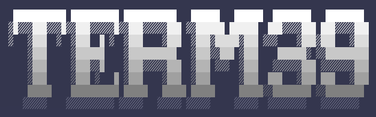
</div>

## Screenshots

<div align="center">
  <a href="assets/screenshot1.png">
    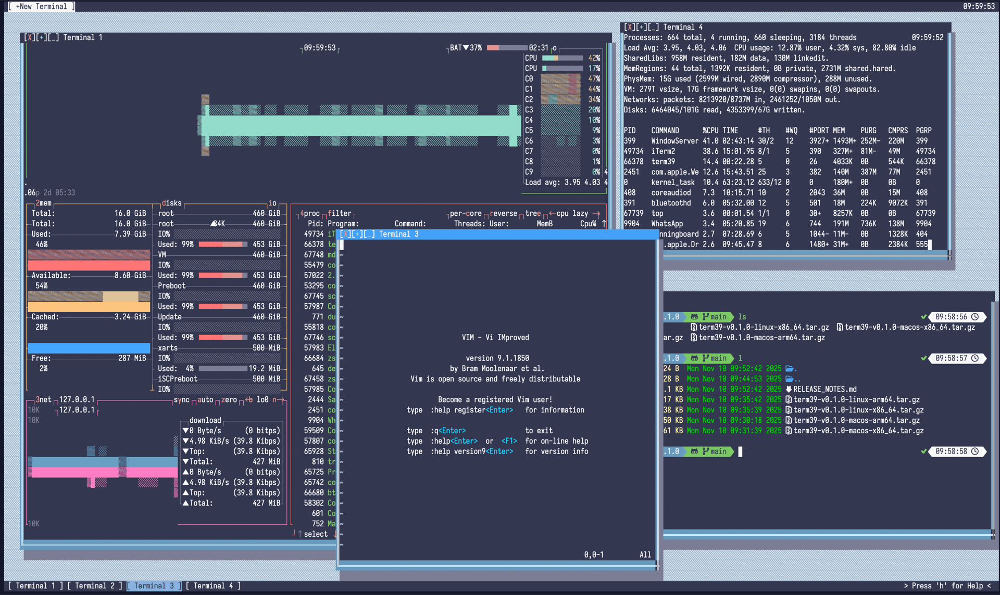
  </a>

<br><br>

  <table>
    <tr>
      <td align="center">
        <a href="assets/screenshot2.png">
          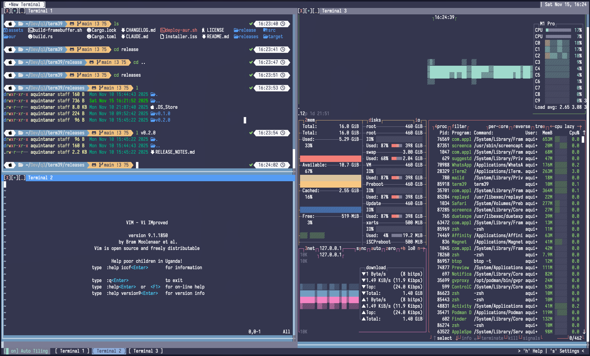
        </a>
      </td>
      <td align="center">
        <a href="assets/screenshot3.png">
          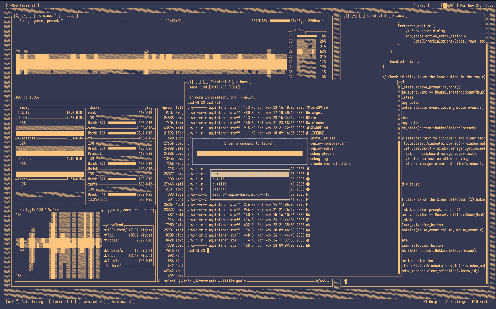
        </a>
      </td>
    </tr>
    <tr>
      <td align="center">
        <a href="assets/screenshot4.png">
          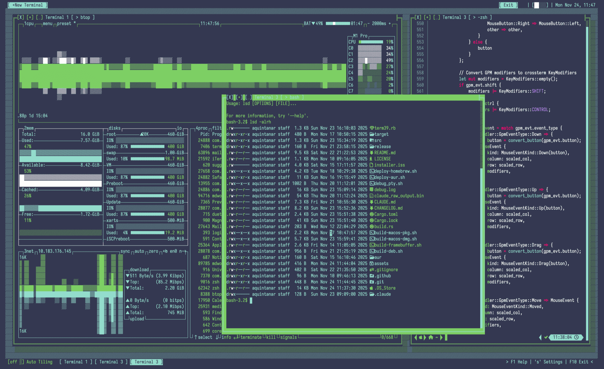
        </a>
      </td>
      <td align="center">
        <a href="assets/screenshot5.png">
          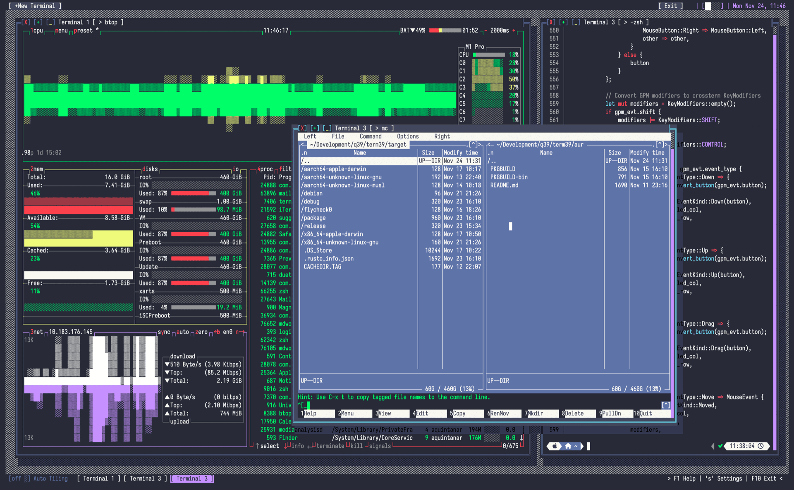
        </a>
      </td>
    </tr>
  </table>

  <p><em>Click on any image to view full size</em></p>
</div>

## Features

**General**

- **Retro DOS Aesthetic**: Classic blue-and-white color scheme with box-drawing characters, ~60fps rendering
- **Multiple Terminal Windows**: Create, drag, resize, minimize, and maximize windows with mouse or keyboard
- **Window Management**: Automatic tiling, snap to corners, focus management with ALT+TAB
- **Control Center**: Centralized panel with WiFi status, time/date, clipboard, and settings access
- **Session Persistence**: Auto-save/restore of window layouts and terminal content between sessions
- **Command Launcher**: Quick command palette with `Ctrl+Space`
- **Clipboard Support**: System clipboard integration with drag-to-select, Ctrl+Shift+C/V, right-click menu
- **Lockscreen**: System-authenticated lockscreen with `Shift+Q`, supports PAM (Linux), Directory Services (macOS), and Windows Security
- **Customizable Themes**: Classic (default), Dark, Monochrome, Green Phosphor, Amber, Dracu, NDD, QBasic, TurboP, NCC, XT, WP, dB, System (via `--theme` flag)
- **Battery Indicator**: Real-time battery status display in the top bar
- **Cross-Platform**: Linux, macOS, Windows, FreeBSD, NetBSD, OpenBSD with full VT100/ANSI support and true color
- **ASCII Compatibility**: `--ascii` flag for maximum terminal compatibility

**Linux Only**

- **Framebuffer Mode**: Direct `/dev/fb0` rendering with DOS text modes (40x25, 80x25, ... , 320x200)
- **Console Mouse**: Native mouse support on Linux TTY via raw `/dev/input` devices

## Installation

### From crates.io (Recommended)

```bash
# Standard installation
cargo install term39

# Linux with framebuffer support
cargo install term39 --features framebuffer-backend
```

Requires Rust ([Install](https://rustup.rs/))

### Linux Packages

**Homebrew**:

```bash
brew tap alejandroqh/term39
brew install term39
```

Or download from [Releases](https://github.com/alejandroqh/term39/releases/latest):

- **Fedora/RHEL**:
  ```bash
  sudo rpm -i term39-*-1.x86_64.rpm
  # or: sudo dnf install term39-*-1.x86_64.rpm
  ```
- **Arch (AUR)**: `yay -S term39-bin` or `yay -S term39`
- **Tarball**:
  ```bash
  tar xzf term39-v*-linux-x86_64.tar.gz
  sudo mv term39 /usr/local/bin/
  ```

### macOS

**Homebrew** (Recommended):

```bash
brew tap alejandroqh/term39
brew install term39
```

Or download from [Releases](https://github.com/alejandroqh/term39/releases/latest):

**Option 1: PKG Installer**

- Intel: `term39-v*-macos-intel.pkg`
- Apple Silicon: `term39-v*-macos-apple-silicon.pkg`

**Right-click** the PKG file and select **"Open"** to install (macOS will show a security warning for unsigned apps). The binary will be automatically placed in `/usr/local/bin/`.

**Option 2: DMG Installer**

- Intel: `term39-v*-macos-intel.dmg`
- Apple Silicon: `term39-v*-macos-apple-silicon.dmg`

**Right-click** the DMG file and select **"Open"**, then drag the app into the Applications folder.

**Option 3: Manual Installation**

```bash
# Intel (x86_64)
tar xzf term39-v*-macos-64bit-x86-binary.tar.gz
sudo mv term39 /usr/local/bin/

# Apple Silicon (ARM64)
tar xzf term39-v*-macos-64bit-arm-binary.tar.gz
sudo mv term39 /usr/local/bin/
```

### Windows

Download from [Releases](https://github.com/alejandroqh/term39/releases/latest):

```powershell
# Option 1: Run the installer (x86_64)
.\term39-v*-windows-x86_64-pc-windows-msvc-installer.exe

# Option 2: Portable - Extract ZIP
Expand-Archive term39-v*-windows-x86_64.zip
# Add to PATH (optional)
$env:Path += ";$PWD\term39-v*-windows-x86_64"
```

**Runtime Requirement:** If you see errors about `MSVCP140.dll` or `VCRUNTIME140.dll`, install the [Microsoft Visual C++ Redistributable](https://aka.ms/vs/17/release/vc_redist.x64.exe) ([x86 version](https://aka.ms/vs/17/release/vc_redist.x86.exe) for 32-bit systems).

### From Source

```bash
git clone https://github.com/alejandroqh/term39.git
cd term39
# Add --features framebuffer-backend for Linux framebuffer
cargo build --release
./target/release/term39
```

### Android/Termux

For Android/Termux, install or build without the clipboard feature:

```bash
# Install Rust in Termux
pkg install rust

# Option 1: Install from crates.io (disable clipboard for Android compatibility)
cargo install term39 --no-default-features

# Option 2: Build from source
git clone https://github.com/alejandroqh/term39.git
cd term39
cargo build --release --no-default-features
./target/release/term39
```

**Note**: The `--no-default-features` flag disables system clipboard integration (which is not supported on Android). Copy/paste will still work within the app using an internal buffer.

### FreeBSD (Experimental)

> **Note:** BSD support is experimental. Please report any issues on [GitHub](https://github.com/alejandroqh/term39/issues).

Download from [Releases](https://github.com/alejandroqh/term39/releases/latest):

```bash
tar xzf term39-*-freebsd-64bit-x86-binary.tar.gz
sudo mv term39 /usr/local/bin/
```

Or build from source:

```bash
# FreeBSD with PAM lockscreen
cargo build --release --no-default-features --features bsd

# FreeBSD without lockscreen
cargo build --release --no-default-features --features bsd-minimal
```

### NetBSD / OpenBSD (Experimental)

> **Note:** BSD support is experimental. Please report any issues on [GitHub](https://github.com/alejandroqh/term39/issues).

Build from source (no pre-built binaries available):

```bash
# NetBSD with PAM lockscreen
cargo build --release --no-default-features --features bsd

# OpenBSD (no PAM, use PIN authentication)
cargo build --release --no-default-features --features bsd-minimal
```

**Note:** On OpenBSD, PAM is not available. Use `bsd-minimal` feature which enables PIN-based lockscreen authentication instead.

## Usage

```bash
./term39                 # Run with Unicode (recommended)
./term39 --ascii         # ASCII mode for compatibility
./term39 --theme dark    # Themes: classic, dark, monochrome,
                         #         green_phosphor, amber, dracu,
                         #         ndd, qbasic, turbo, nc, xt,
                         #         wp, db, system
```

### Keyboard Shortcuts

**General**
| Key | Action | Key | Action |
|-----|--------|-----|--------|
| `t` / `T` | New window / Maximized window | `q` / `ESC` | Exit (desktop) |
| `F1` / `?` / `h` | Show help | `s` | Settings |
| `l` | License | `c` | Calendar |
| `Ctrl+Space` | Command launcher | `Shift+Q` / `F12` | Lock screen |

**Window & Session**
| Key | Action | Key | Action |
|-----|--------|-----|--------|
| `F2` / `ALT+TAB` | Switch windows | `Ctrl+S` / `F3` | Save session |
| `F4` / `Ctrl+L` | Clear terminal | `` ` `` / `F8` | Window Mode |

**Copy & Paste**
| Key | Action | Key | Action |
|-----|--------|-----|--------|
| `F6` / `Ctrl+Shift+C` | Copy selection | `F7` / `Ctrl+Shift+V` | Paste |
| `Cmd+C` (macOS) | Copy selection | `Cmd+V` (macOS) | Paste |

**Dialog Controls**
| Key | Action | Key | Action |
|-----|--------|-----|--------|
| `TAB` / Arrow keys | Navigate buttons | `ENTER` | Activate button |
| `ESC` | Close dialog | | |

### Mouse Controls

- **Title bar**: Drag to move | **Ctrl+Drag**: Move without snap | **╬ handle**: Resize
- **[X]/[+]/[_]**: Close/Maximize/Minimize | **Click window**: Focus
- **Bottom bar**: Switch windows | **Drag text**: Select | **Right-click**: Context menu

### Keyboard-Only Mode (Window Mode)

Press **`` ` ``** (backtick) or **F8** to enter Window Mode for full keyboard control of windows. Press again to exit.

**Navigation**
| Key | Action |
|-----|--------|
| `h` / `←` | Focus window to left |
| `j` / `↓` | Focus window below |
| `k` / `↑` | Focus window above |
| `l` / `→` | Focus window to right |
| `Tab` | Cycle to next window |
| `Shift+Tab` | Cycle to previous window |

**Snap to Half Screen**
| Key | Action |
|-----|--------|
| `H` (Shift+h) | Snap to left half |
| `J` (Shift+j) | Snap to bottom half |
| `K` (Shift+k) | Snap to top half |
| `L` (Shift+l) | Snap to right half |

**Numpad-Style Snap Positions (1-9)**

```
7 Top-Left     8 Top-Center     9 Top-Right
4 Middle-Left  5 Center         6 Middle-Right
1 Bottom-Left  2 Bottom-Center  3 Bottom-Right
```

**Window Actions**
| Key | Action |
|-----|--------|
| `m` | Enter Move mode |
| `r` | Enter Resize mode |
| `z` / `+` / `Space` | Toggle maximize |
| `-` / `_` | Toggle minimize |
| `x` / `q` | Close focused window |
| `?` | Show help overlay |

**Move Mode** (press `m` to enter)
| Key | Action |
|-----|--------|
| `h/j/k/l` or arrows | Move window (adaptive speed) |
| `Shift+H/J/K/L` | Snap window to edge |
| `Enter` / `Esc` / `m` | Exit Move mode |

**Resize Mode** (press `r` to enter)
| Key | Action |
|-----|--------|
| `h` / `l` | Shrink / Grow width |
| `k` / `j` | Shrink / Grow height |
| `Shift` + key | Invert resize direction |
| `Enter` / `Esc` / `r` | Exit Resize mode |

**Tip:** Double-press `` ` `` quickly to send a literal backtick to the terminal.

## Command-Line Options

### General Options

| Option            | Description                                                                        |
| ----------------- | ---------------------------------------------------------------------------------- |
| `--ascii`         | Use ASCII-compatible characters (`+-\|#`) instead of Unicode box-drawing           |
| `--single-line`   | Use single-line Unicode box characters (`┌─┐│└┘`) instead of double-line           |
| `--theme <THEME>` | Set color theme (see [Themes](#themes) section)                                    |
| `--tint-terminal` | Apply theme-based color tinting to terminal content                                |
| `--no-restore`    | Don't restore previous session on startup                                          |
| `--no-save`       | Don't save session (disables auto-save and manual save)                            |
| `--no-exit`       | Disable exit functionality (for use as a window manager)                           |
| `--shell <SHELL>` | Specify custom shell for terminal windows (e.g., `--shell /bin/zsh`)               |
| `--lock`          | Lock a running term39 instance and exit (Unix only, see [Lockscreen](#lockscreen)) |

### Linux Console Options

| Option                        | Description                                                                              |
| ----------------------------- | ---------------------------------------------------------------------------------------- |
| `-f`, `--framebuffer`         | Enable framebuffer mode (requires `/dev/fb0` access)                                     |
| `--fb-mode <MODE>`            | Text mode: `40x25`, `80x25`, `80x43`, `80x50`, `160x50`, `160x100`, `320x100`, `320x200` |
| `--fb-scale <SCALE>`          | Pixel scale factor (`1`, `2`, `3`, `4`, or `auto`)                                       |
| `--fb-font <FONT>`            | Console font name (e.g., `Unifont-APL8x16`)                                              |
| `--fb-list-fonts`             | List available console fonts and exit                                                    |
| `--fb-setup`                  | Launch interactive framebuffer setup wizard                                              |
| `--mouse-device <DEVICE>`     | Mouse input device (e.g., `/dev/input/event2`)                                           |
| `--mouse-sensitivity <VALUE>` | Mouse sensitivity for TTY mode (`0.1`-`5.0`, default: auto)                              |
| `--swap-mouse-buttons`        | Swap left/right mouse buttons                                                            |
| `--invert-mouse-x`            | Invert mouse X-axis movement                                                             |
| `--invert-mouse-y`            | Invert mouse Y-axis movement                                                             |

**Note:** Linux console options require `--features framebuffer-backend` at compile time and running on a physical console (TTY1-6), not in terminal emulators or SSH.

## Themes

<div align="center">
  <table>
    <tr>
      <td align="center">
        <a href="assets/themes/NDD.png">
          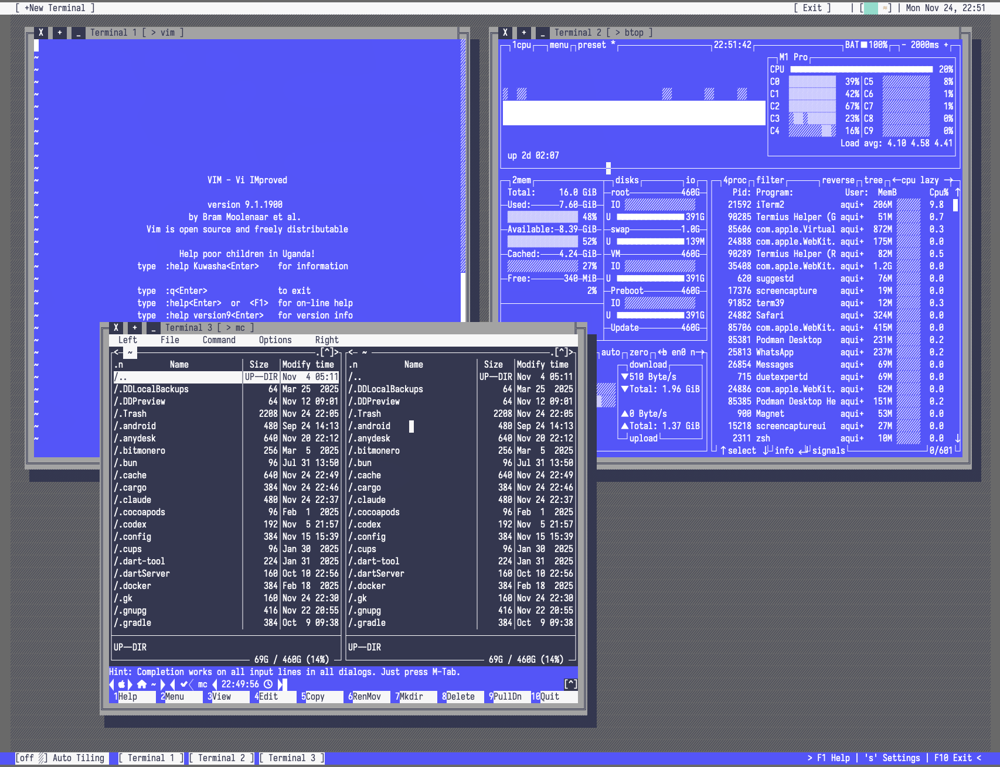
        </a><br><sub>NDD</sub>
      </td>
      <td align="center">
        <a href="assets/themes/Qbasic.png">
          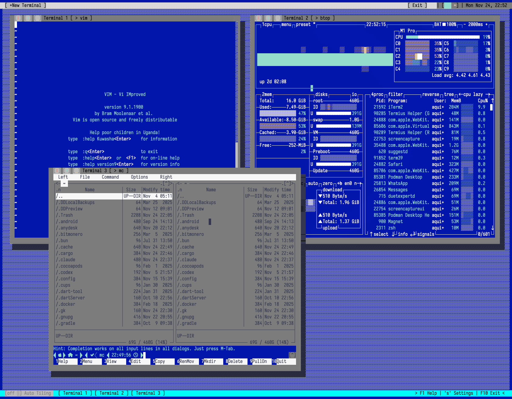
        </a><br><sub>Qbasic</sub>
      </td>
      <td align="center">
        <a href="assets/themes/TurboP.png">
          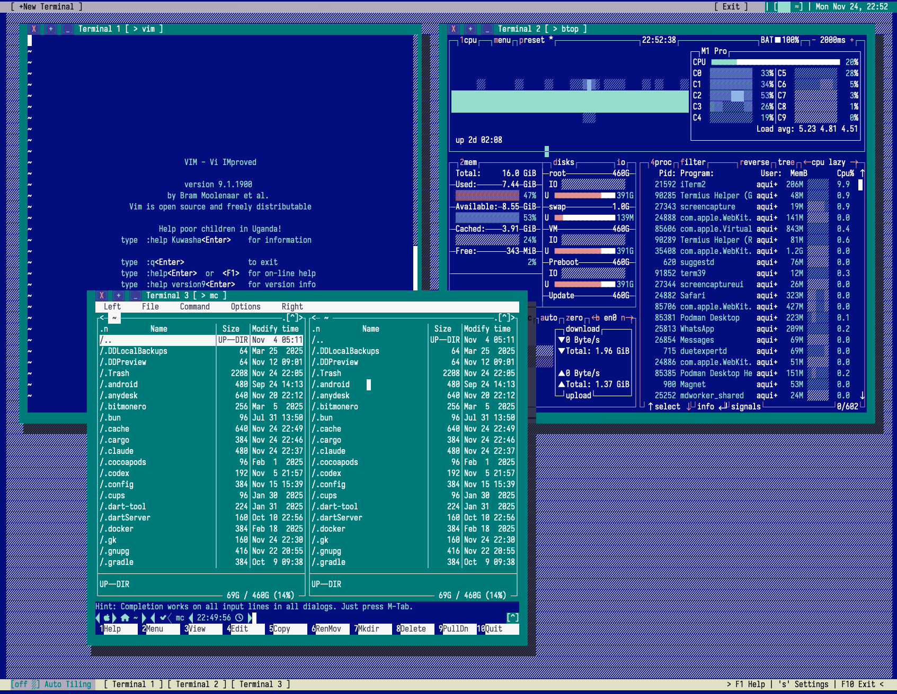
        </a><br><sub>TurboP</sub>
      </td>
    </tr>
    <tr>
      <td align="center">
        <a href="assets/themes/NCC.png">
          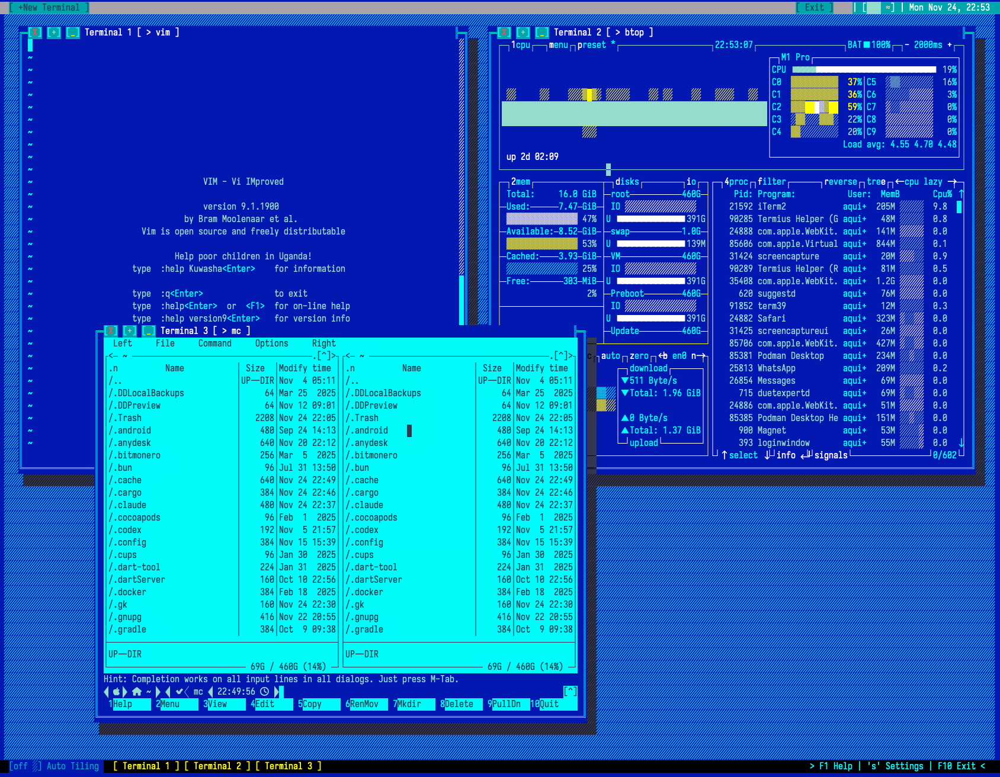
        </a><br><sub>NCC</sub>
      </td>
      <td align="center">
        <a href="assets/themes/Dracu.png">
          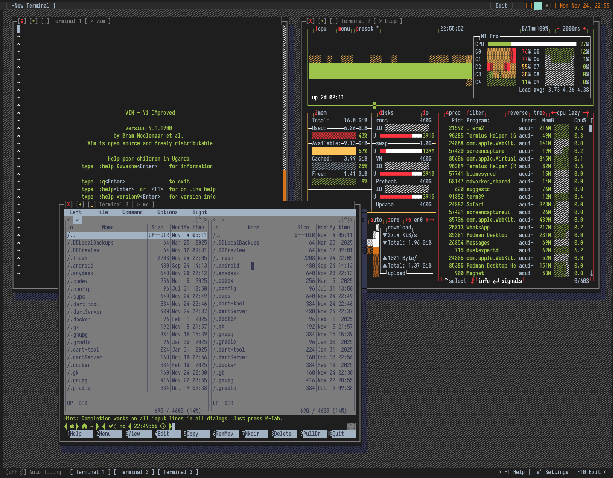
        </a><br><sub>Dracu</sub>
      </td>
      <td align="center">
        <a href="assets/themes/Dark.png">
          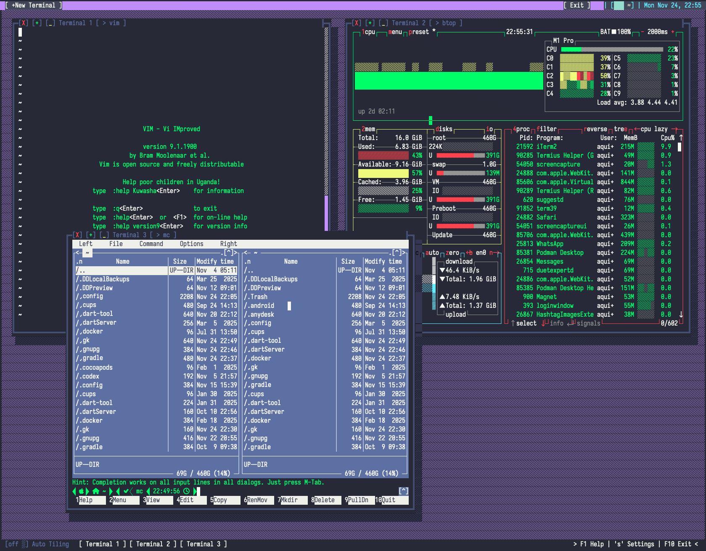
        </a><br><sub>Dark</sub>
      </td>
    </tr>
    <tr>
      <td align="center">
        <a href="assets/themes/XT.png">
          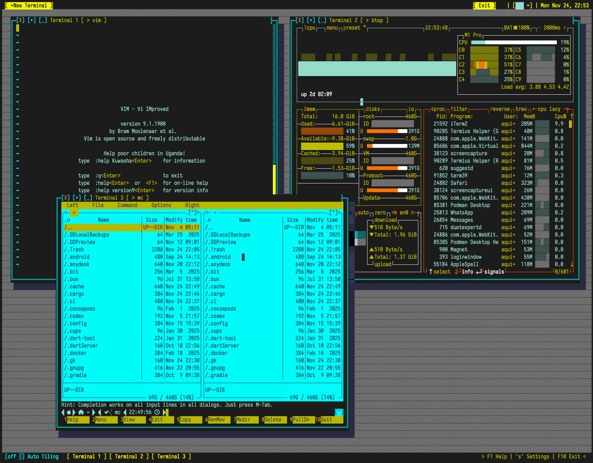
        </a><br><sub>XT</sub>
      </td>
      <td align="center">
        <a href="assets/themes/WP.png">
          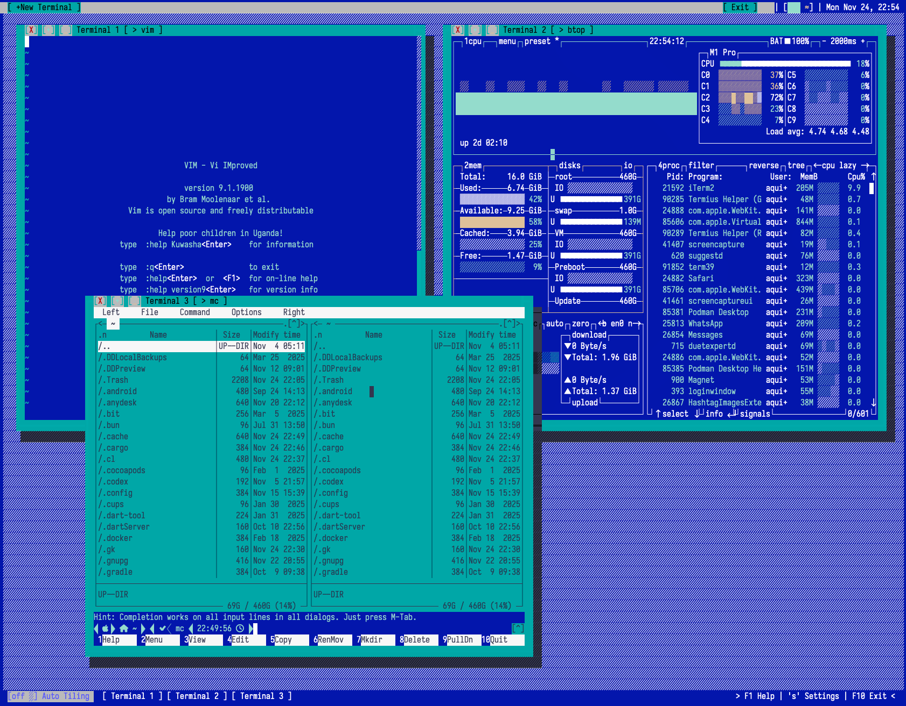
        </a><br><sub>WP</sub>
      </td>
      <td align="center">
        <a href="assets/themes/dB.png">
          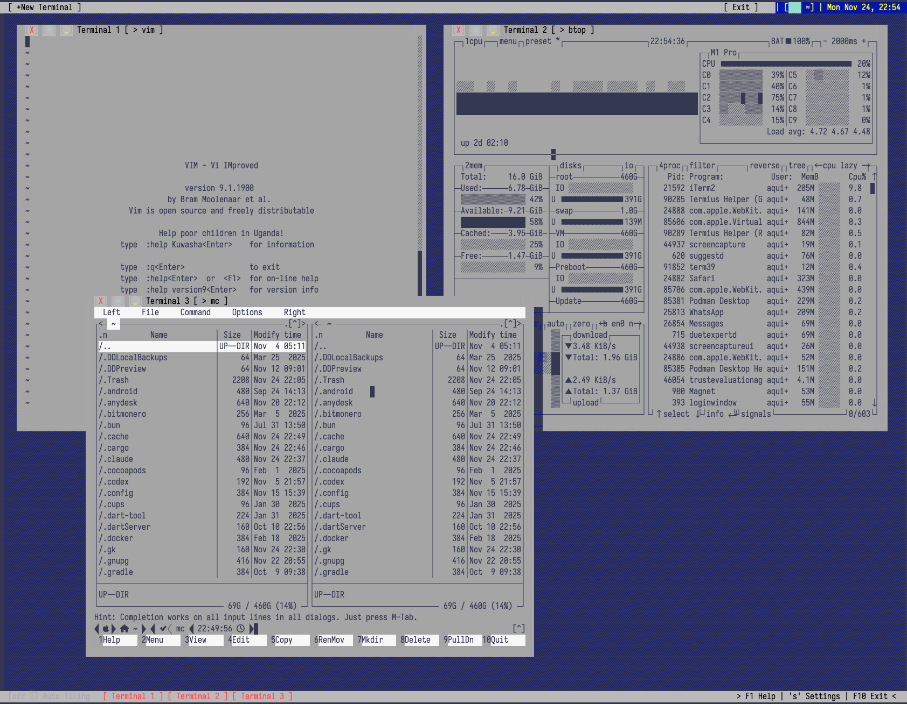
        </a><br><sub>dB</sub>
      </td>
    </tr>
  </table>
</div>

## Lockscreen

System-authenticated lockscreen using PAM (Linux, FreeBSD, NetBSD), Directory Services (macOS), or Windows Security. OpenBSD uses PIN authentication.

| Trigger       | Command                      |
| ------------- | ---------------------------- |
| Keyboard      | `Shift+Q`                    |
| CLI (Unix)    | `term39 --lock`              |
| Signal (Unix) | `kill -USR1 $(pgrep term39)` |

**Features:** Opaque background, progressive lockout (5s→120s after 3+ failures), auto-fill username.

**Note:** Disabled with warning if authentication system unavailable.

## Architecture

**Core**: Double-buffered video system, window manager (Z-order/focus), VT100/ANSI parser (VTE), PTY integration (portable-pty)
**Rendering**: Front/back buffers with dirty tracking, save/restore regions, shadow system for depth

## Development

**Prerequisites**: Rust 1.70+ ([Install](https://rustup.rs/))

```bash
cargo build --release                     # Build optimized binary
cargo run -- --ascii                      # Run in ASCII mode
cargo test && cargo clippy && cargo fmt   # Test, lint, format
```

## Configuration

Configuration files are stored in `~/.config/term39/`:

| File           | Description                                      |
| -------------- | ------------------------------------------------ |
| `session.toml` | Saved session (window layouts, terminal content) |
| `fb.toml`      | Framebuffer settings (Linux only)                |

Available themes: `classic` (default), `dark`, `monochrome`, `green_phosphor`, `amber`, `dracu`, `ndd`, `qbasic`, `turbo`, `nc`, `xt`, `wp`, `db`, `system`

## Contributing

See [CONTRIBUTING.md](CONTRIBUTING.md) for guidelines on how to contribute to this project.

## Dependencies

**Core**: [crossterm](https://github.com/crossterm-rs/crossterm) (terminal I/O), [chrono](https://github.com/chronotope/chrono) (clock), [portable-pty](https://github.com/wez/wezterm/tree/main/pty) (PTY), [vte](https://github.com/alacritty/vte) (ANSI parser), [clap](https://github.com/clap-rs/clap) (CLI args), [serde](https://github.com/serde-rs/serde)/[toml](https://github.com/toml-rs/toml) (config)

**Optional**: [arboard](https://github.com/1Password/arboard) (clipboard, default), [framebuffer](https://github.com/royaltm/rust-framebuffer) (Linux FB mode)

## Cargo Features

### `clipboard` (Default: **ON**)

System clipboard integration with Ctrl+Shift+C/V.

- **Enable**: Desktop usage, copy/paste between apps
- **Disable**: Android/Termux, headless servers → `--no-default-features`

### `framebuffer-backend` (Default: **ON** for Linux)

Direct Linux framebuffer rendering with DOS text modes (40x25, 80x25, ... , 320x200).

- **Modes**: 40x25, 80x25, 80x43, 80x50, 160x50, 160x100, 320x100, 320x200
- **Platform**: Linux only (automatically disabled on macOS/Windows)
- **Disable**: To opt-out on Linux → `--no-default-features --features clipboard`
- **Requires**: `/dev/fb0` access (root or 'video' group), physical console only

```bash
# Build/Install
# Standard (includes framebuffer on Linux)
cargo build --release

# Without framebuffer
cargo build --release --no-default-features --features clipboard

## Minimal (no clipboard, no framebuffer)
cargo build --release --no-default-features

# Standard (includes framebuffer on Linux)
cargo install term39

# Without framebuffer
cargo install term39 --no-default-features --features clipboard

# Run framebuffer
sudo ./target/release/term39 -f --fb-mode=80x25
```

### `bsd` Feature Profile (Experimental)

Full BSD support with PAM lockscreen (FreeBSD, NetBSD). BSD support is experimental.

```bash
cargo build --release --no-default-features --features bsd
```

### `bsd-minimal` Feature Profile (Experimental)

BSD support without PAM (OpenBSD, or when PAM is unavailable). BSD support is experimental.

```bash
cargo build --release --no-default-features --features bsd-minimal
```

## License

MIT License - see [LICENSE](LICENSE) file.

## Support

[Issues](https://github.com/alejandroqh/term39/issues) | [Discussions](https://github.com/alejandroqh/term39/discussions) | [Wiki](https://github.com/alejandroqh/term39/wiki)
